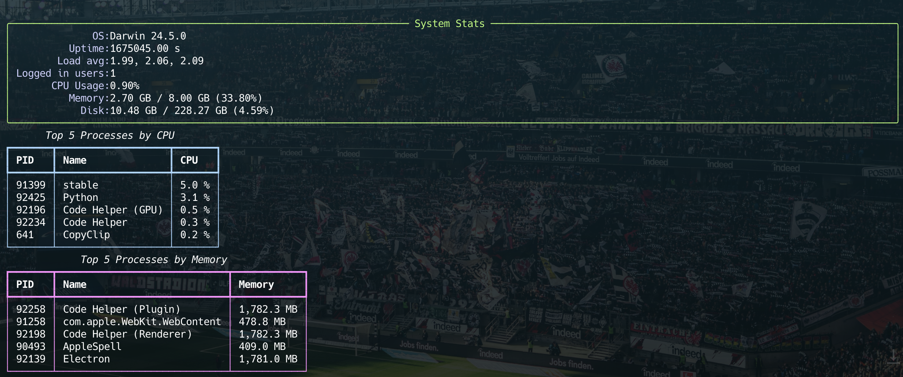

# CLI Server Performance Monitor

A lightweight Python CLI tool for real-time system performance monitoring. This tool provides a clean, colorful interface to monitor CPU usage, memory consumption, disk space, and the top processes consuming system resources.

## Features

- 📊 **Real-time monitoring** - Updates every 5 seconds
- 🖥️ **System overview** - OS info, uptime, load average, and logged users
- ⚡ **CPU monitoring** - Current CPU usage percentage
- 🧠 **Memory tracking** - RAM usage with detailed breakdown
- 💾 **Disk space** - Storage usage and availability
- 🔝 **Top processes** - Shows top 5 processes by CPU and memory usage
- 🎨 **Rich interface** - Colorful tables and panels using Rich library
- 🔄 **Auto-refresh** - Continuous monitoring with clean screen updates

## Screenshots



The tool displays information in organized panels:
- **System Stats Panel** (Green border) - Shows OS, uptime, load, users, CPU, memory, and disk
- **Top CPU Processes Table** (Blue border) - Lists processes with highest CPU usage
- **Top Memory Processes Table** (Magenta border) - Lists processes with highest memory usage

## Requirements

- Python 3.13+
- Dependencies managed with `uv`

## Installation

1. **Clone the repository:**
   ```bash
   git clone <repository-url>
   cd cli-server-performance-monitor
   ```

2. **Install dependencies using uv:**
   ```bash
   uv sync
   ```

   Or if you prefer pip:
   ```bash
   pip install psutil rich
   ```

## Usage

Run the performance monitor:

```bash
python main.py
```

The tool will start displaying real-time system performance data. Press `Ctrl+C` to exit.

## Dependencies

- **[psutil](https://pypi.org/project/psutil/)** (>=7.0.0) - Cross-platform library for system and process monitoring
- **[rich](https://pypi.org/project/rich/)** (>=14.1.0) - Rich text and beautiful formatting in the terminal

## What It Monitors

### System Information
- Operating system and version
- System uptime
- Load average (1, 5, 15 minutes)
- Number of logged-in users

### Resource Usage
- **CPU Usage**: Real-time CPU utilization percentage
- **Memory Usage**: Used/Total RAM with percentage
- **Disk Usage**: Used/Total disk space with percentage

### Process Information
- **Top 5 CPU-intensive processes**: PID, name, and CPU percentage
- **Top 5 memory-intensive processes**: PID, name, and memory usage in MB

## Configuration

The monitoring interval is set to 5 seconds by default. You can modify this by changing the `time.sleep(5)` value in the main loop.

## Platform Support

This tool works on:
- ✅ Linux
- ✅ macOS  
- ✅ Windows

Note: Load average information may not be available on Windows systems.
